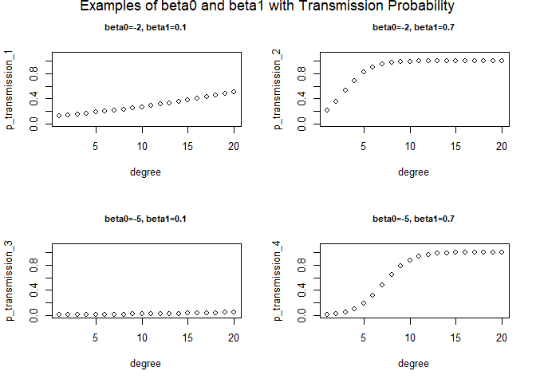

Modeling Social Diffusion in a Social Network
=============================================

### Description

This example feataures an information diffusion model based on an SI (susceptible-infected) contagion process in EpiModel. This model may represent dissemination of new ideas across a social network. In contrast to a typical epidemic model transmission process in which transmission requires only two discordant nodes, social difficusion may require more complex network connectivity, such as:

**Scenario 1:** A minimum threshold of degree (e.g., current friendships) who have the new idea/meme; in this case, the probability of disseminating an idea may require a deterministic minimum treshold of current contacts that have the idea.

**Scenario 2:** The probability of transmission may instead be a continuous function of degree of idea-discordant contacts. This continuous probability could be expressed on the log odds scale (to constrain the marginal probability between 0 and 1). Parameters for this scenario would be log odds coefficients for the intercept and slope (see examples below).

### Modules

#### Scenario 1
The **infection module** (function = `infect_mod`) includes the following changes from the base EpiModel infection module (`infection.net`):

  - Querying the degree of discordant edges for susceptible nodes.
  - The infection probability is only assigned to susceptible nodes with more than minimum degree of discordant edges, otherwise is 0.

#### Scenario 2
The **infection module** (function = `infect_mod2`) includes the following changes from the base EpiModel infection module (`infection.net`):

  - Querying the degree of discordant edges for susceptible nodes
  - The infection probability is a logistic function of degree of discordant edges for susceptible nodes with user specified paramters.

### Parameters

The new or altered epidemic model parameters are as follows.

#### Scenario 1

  - `min.degree`: the minimum degree of information-discordant contacts for the diffusion to occur

#### Scenario 2

  - `beta0`: the baseline log odds of diffusion when susceptible individuals have 0 degree of discordant contacts; usually negative as transmission probability is usually 0 when one has 0 degree of discordant contacts (a suggested coefficient may be `-3`).
  - `beta1`: the increase of log odds with 1 degree increase of discordant contacts; usually positive as an increase of degree would increase the diffusion probability.

### Worked Examples

In Example 1 in `model.R`, we consider a situation in which people are densely connected and susceptible individuals only aquire new ideas if they have more than 3 partnerships with infected individuals (`min.degree = 3`). Similar to an   SI epidemic model, the diffusion process is slow initially and increases as more people become infected with the idea. However, the `si.flow` is lower than normal SI model and not as smooth as infectious probability jumps at minimum degree.

In Example 2 in `model.R`, this model specifies the baseline transmission probability at almost 0 when susceptible individuals have 0 discordant contacts (`beta0 = -7`), and transmission probability increases relatively fast with the increase of the degree (`beta1 = 0.5`). The process is similar to infection process in normal SI model, incidence increases initially as more people are infected then decreases as the susceptible population decreases.

## Author
Yuan Zhao, Emory University
